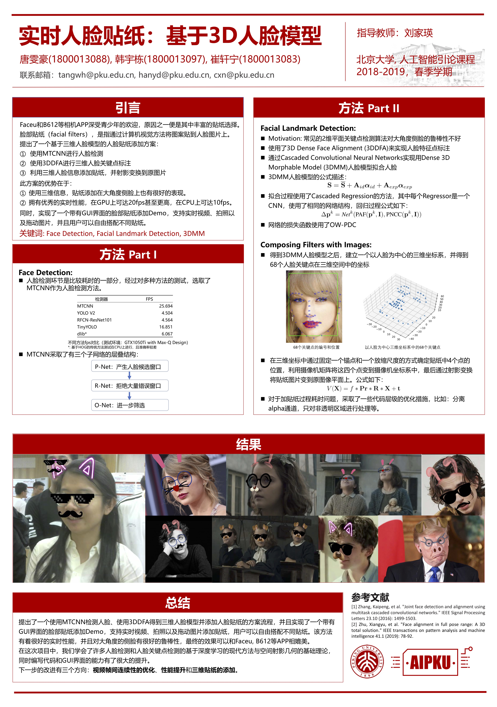

# 实时人脸贴纸：基于3D人脸模型

Author: [Candy?](https://github.com/thwfhk), [maghsk](https://github.com/maghsk), [CeoxNim](https://github.com/CeoxNim)

## 项目说明

这是一个使用深度学习方法的实时人脸贴纸项目，代码全部使用python完成。

这是AI引论课CV实践课的一个课程大作业。

具体内容请见`poster.pdf`

## 代码说明

`main.py` 是主程序，`python main.py`可以进入图形化界面。

默认使用CPU，如果要改用GPU，请使用`python main.py -device='gpu'`

`a_fb.py`和`a_mbn.py`是各部分的拼接，不同之处在于一个使用faceboxes另一个使用mobilenet。

`MEOW3DDFA`里是3DDFA部分，其中`a_3ddfa.py`是接口。

`deepface`是使用GPU的人脸检测，方法是mobilenet

`FaceBoxes`是使用CPU的人脸检测，方法是faceboxes

(PS:我们在后期版本中弃用了MTCNN)

`filters.py`是添加贴纸的代码。

`big-final.ui`和`ui.py`等是GUI相关文件。

如果有任何运行问题，请联系 tangwh@pku.edu.cn

## References
* https://github.com/cleardusk/3DDFA
* https://github.com/zisianw/FaceBoxes.PyTorch
* https://github.com/ildoonet/deepface